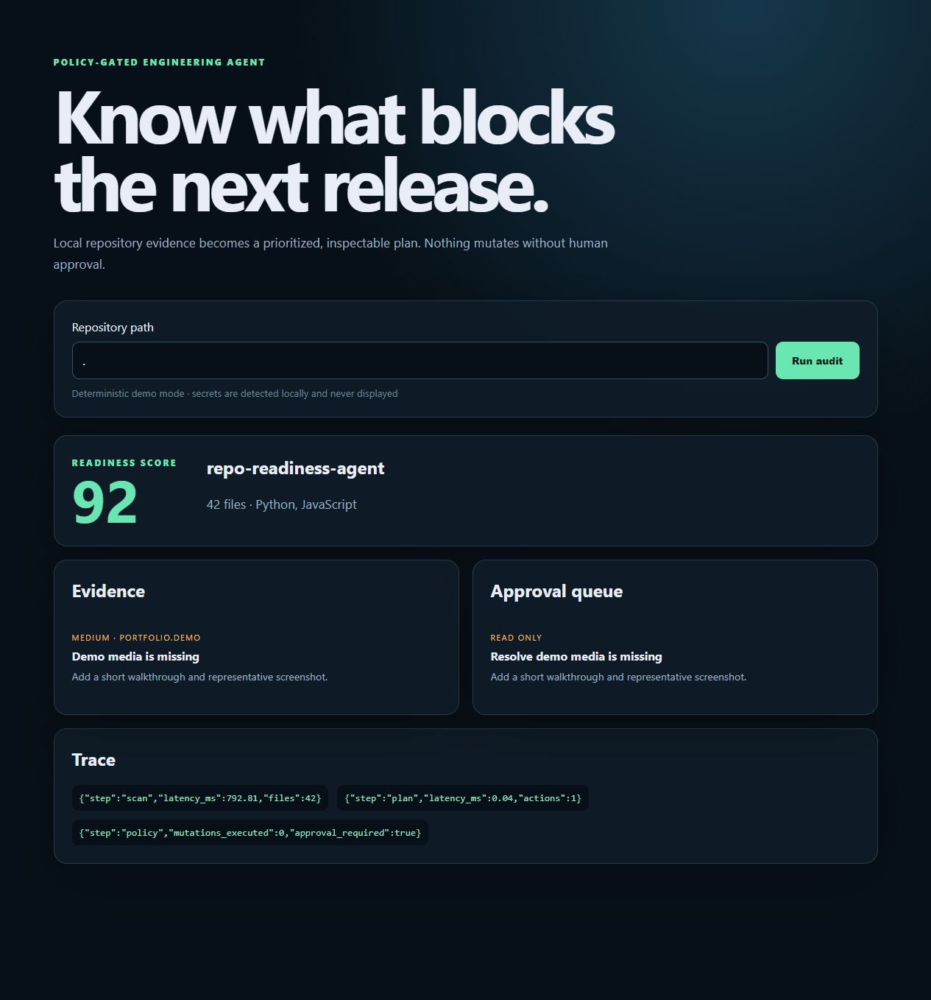

# Repo Readiness Agent

A policy-gated engineering agent that turns repository evidence into a prioritized readiness plan. It scans locally, redacts suspected credentials, records an inspectable trace, and refuses mutation unless a human approves the exact action.



[Watch the 75-second demo](docs/demo.mp4)

> The default demo is deterministic and needs no API key. An optional OpenAI Responses API planner can produce schema-constrained action proposals; it still cannot bypass the approval policy.

## Why this exists

Repositories often look finished while the important evidence is missing: regression tests, CI, demo proof, ownership signals, or safe secret handling. This project treats readiness as an auditable agent workflow rather than a vibes-based checklist.

## Agent loop

1. Inventory repository artifacts while skipping dependency and build directories.
2. Detect missing engineering/product evidence and redact possible credentials.
3. Ask either the deterministic planner or optional model planner for proposed actions.
4. Persist findings, latency, planner identity, and the approval queue as JSON.
5. Block every mutation without an action-specific human approval token.

## Run locally

```bash
python -m venv .venv
source .venv/bin/activate  # Windows: .venv\Scripts\activate
python -m pip install -e ".[dev]"
uvicorn readiness_agent.api:app --reload
```

Open `http://127.0.0.1:8000`. The CLI is also available:

```bash
repo-ready /path/to/repository
```

To use the optional planner, set `OPENAI_API_KEY` and pass `--model`. Model output is constrained to an action-plan JSON schema and actions remain proposals only.

## Evaluation and safety claims

- The test suite exercises secret redaction, path traversal rejection, durable replay, API behavior, and mutation approval.
- CI enforces lint plus at least 85% statement coverage.
- Scans are local. File contents are not sent to a model; only normalized findings are eligible for the optional planner.
- Potential secret values never appear in persisted evidence.
- This project does not push commits, open pull requests, change visibility, or edit source code.

## Architecture

```text
repository -> deterministic scanner -> normalized findings -> planner
                                                        |-> deterministic
                                                        `-> OpenAI (optional)
planner -> proposed actions -> policy gate -> approval queue
       `-> trace + durable JSON run record
```

## Roadmap

- GitHub App installation with least-privilege, read-only permissions
- SARIF export and configurable organization policies
- Benchmark corpus of synthetic repository failure modes
- Sandboxed patch previews behind explicit approval

## License

MIT. The scanner, policy layer, demo UI, and tests in this repository were created for this project.
